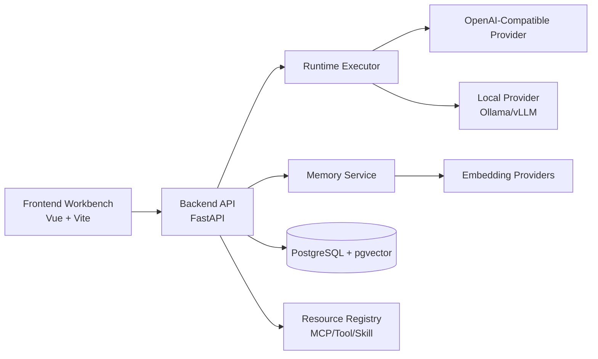

# HyperAgents

<p align="center">
	<strong>A project-first Agent Operating System for teams.</strong><br/>
	Build, orchestrate, and test AI agents with unified runtime, memory, and resource registry.
</p>

<p align="center">
	<a href="LICENSE"></a>
	<a href="https://github.com/monkeyhlj"></a>
	<a href="https://blog.csdn.net/hhhmonkey"></a>
	<a href="https://github.com/monkeyhlj/HyperAgents"></a>
	<a href="https://github.com/monkeyhlj/HyperAgents/issues"></a>
	<a href="https://github.com/monkeyhlj/HyperAgents/pulls"></a>
	<a href="https://github.com/monkeyhlj/HyperAgents/stargazers"></a>
	<a href="https://github.com/monkeyhlj/HyperAgents/network/members"></a>
</p>

<p align="center">
	
	
	
	
	
</p>

<p align="center">
	<a href="README.en.md">English</a>
	·
	<a href="README.zh.md">中文</a>
	·
	<a href="docs/README.md">Docs</a>
</p>

<p align="center">
	Docs Site: <a href="https://monkeyhlj.github.io/HyperAgents/">https://monkeyhlj.github.io/HyperAgents/</a>
</p>

## Why HyperAgents

HyperAgents is designed for teams that want more than a chat demo. It provides a clear project boundary, structured resources, a provider-agnostic runtime, and memory capabilities that can evolve from local development to production-grade deployment.

## Core Capabilities

- Project-first model: all resources belong to a project and follow visibility policies.
- Unified resource system: Agent, Workflow, Tool, Skill, MCP, Knowledge Base.
- Runtime execution layer: route chat requests to OpenAI-compatible or local providers.
- Memory service: write/search memory, auto embedding, retry queue, semantic retrieval.
- Registry APIs: project-scoped registration and cross-project public discovery.
- Full-stack workspace: FastAPI backend and Vue 3 frontend workbench.

## Architecture at a Glance



## Repository Structure

- [backend](backend): FastAPI service, runtime, memory, DB models, Alembic migrations.
- [frontend](frontend): Vue 3 application for project/resource/workbench operations.
- [docs](docs): bilingual node-by-node docs, quick start, and testing playbooks.
- [.env.example](.env.example): centralized environment template.

## Quick Start

1. Copy environment template:

```bash
copy .env.example .env
```

2. Start backend and frontend via scripts:

```bash
./scripts/start-backend.ps1 -Environment dev -RunMigrations
./scripts/start-frontend.ps1 -Environment dev -Install
```

3. Optional but recommended: enable Worker queue mode for async retry tasks.

```bash
# in .env
WORKER_ENABLED=true
WORKER_BROKER_URL=redis://localhost:6379/0
WORKER_BACKEND_URL=redis://localhost:6379/1

# start celery worker
cd backend
.venv\Scripts\activate
celery -A app.workers.celery_app.celery_app worker -l info
```

Notes:

- Runtime Run timeline does not require extra process startup. It is created automatically by chat message execution.
- Worker is required only when you need enqueue=true queue dispatch.
- If worker/redis is unavailable, retry endpoints will fallback to API process execution.

For detailed setup, see:

- [README.en.md](README.en.md)
- [README.zh.md](README.zh.md)
- [docs/guides/quick-start.zh-en.md](docs/guides/quick-start.zh-en.md)
- [docs/guides/runtime-run-worker.zh-en.md](docs/guides/runtime-run-worker.zh-en.md)

## Documentation Index

- [docs/README.md](docs/README.md)
- [docs/guides/testing-playbook.zh-en.md](docs/guides/testing-playbook.zh-en.md)
- [docs/guides/external-resources-integration.zh-en.md](docs/guides/external-resources-integration.zh-en.md)

## Current Status

HyperAgents is under active iteration. APIs and docs are evolving toward a stable v1 workflow for project operations, provider integration, and memory reliability.
