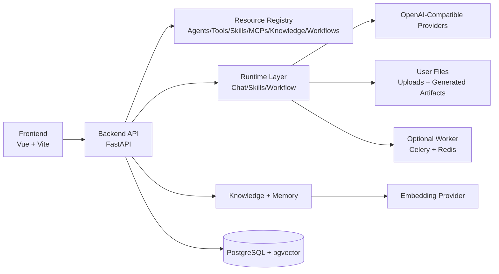

# HyperAgents

<p align="center">
  <strong>A project-first Agent Operating System for teams.</strong><br/>
  Build, bind, orchestrate, and test AI agents with projects, resources, skills, knowledge, workflows, and files in one workspace.
</p>

<p align="center">
  <a href="LICENSE"></a>
  <a href="https://github.com/monkeyhlj"></a>
  <a href="https://blog.csdn.net/hhhmonkey"></a>
  <a href="https://github.com/monkeyhlj/HyperAgents"></a>
  <a href="https://github.com/monkeyhlj/HyperAgents/issues"></a>
  <a href="https://github.com/monkeyhlj/HyperAgents/pulls"></a>
  <a href="https://github.com/monkeyhlj/HyperAgents/stargazers"></a>
</p>

<p align="center">
  
  
  
  
  
</p>

<p align="center">
  <a href="README.en.md">English</a> ·
  <a href="README.zh.md">中文</a> ·
  <a href="docs/README.md">Docs</a> ·
  <a href="https://monkeyhlj.github.io/HyperAgents/">Docs Site</a>
</p>

## What It Is

HyperAgents is a project-first Agent OS prototype. It gives teams a structured place to create projects, manage reusable resources, bind capabilities to agents, run conversations, generate files, and test multi-agent workflows without scattering configuration across scripts and prompts.

## Current Capabilities

- Project and membership management with project/private/public visibility.
- Unified Resources: Agents, Tools, Skills, MCPs, Knowledge Bases, and Workflows.
- Agent Workbench with persisted sessions, runtime traces, bound skill/knowledge indicators, and file outputs.
- Skill runtime support with progressive disclosure, uploaded skill packages, and script-aware execution paths.
- Knowledge base upload, document management, retrieval configuration, and agent binding.
- Visual Workflow builder with graph nodes, branching routes, JSON synchronization, test runs, and run history.
- My Files workspace for uploads, generated artifacts, search, pagination, download, and cleanup.
- Provider profiles and project-level Provider Connections for OpenAI-compatible model endpoints.
- Runtime run/event records, HTTP request logging configuration, and optional worker queue mode.

## Architecture At A Glance


```mermaid
flowchart LR
    UI[Frontend\nVue + Vite] --> API[Backend API\nFastAPI]
    API --> Registry[Resource Registry\nAgents/Tools/Skills/MCPs/Knowledge/Workflows]
    API --> Runtime[Runtime Layer\nChat/Skills/Workflow]
    Runtime --> LLM[OpenAI-Compatible Providers]
    Runtime --> Files[User Files\nUploads + Generated Artifacts]
    API --> Memory[Knowledge + Memory]
    Memory --> Embed[Embedding Provider]
    API --> DB[(PostgreSQL + pgvector)]
    Runtime --> Worker[Optional Worker\nCelery + Redis]
```

## Repository Structure

- [backend](backend): FastAPI service, runtime, skill/workflow execution, DB models, Alembic migrations.
- [frontend](frontend): Vue 3 application for dashboard, projects, resources, workbench, workflows, and files.
- [docs](docs): bilingual documentation site source, module guides, design notes, and operations references.
- [scripts](scripts): Windows PowerShell and Linux/macOS startup scripts.
- [.env.example](.env.example): centralized environment template.

## Quick Start

1. Copy the environment template:

```powershell
copy .env.example .env
```

2. Start backend and frontend:

```powershell
./scripts/start-backend.ps1 -Environment dev -RunMigrations
./scripts/start-frontend.ps1 -Environment dev -Install
```

3. Open the services:

- Backend: `http://localhost:8000`
- Frontend: `http://localhost:5173`
- API docs: `http://localhost:8000/docs`

4. Optional worker mode:

```powershell
cd backend
.venv\Scripts\activate
celery -A app.workers.celery_app.celery_app worker -l info
```

Worker mode requires Redis and is only needed for queue-backed async tasks. Normal chat, resource management, and workflow testing can run in the API process during local development.

## Documentation

- Docs site: [https://monkeyhlj.github.io/HyperAgents/](https://monkeyhlj.github.io/HyperAgents/)
- Local docs portal: [docs/README.md](docs/README.md)
- Quick start: [docs/guides/quick-start.zh-en.md](docs/guides/quick-start.zh-en.md)
- Frontend guide: [docs/guides/frontend-guide.zh-en.md](docs/guides/frontend-guide.zh-en.md)
- Resources: [docs/modules/resources.zh-en.md](docs/modules/resources.zh-en.md)
- Workbench: [docs/modules/workbench.zh-en.md](docs/modules/workbench.zh-en.md)
- Workflows: [docs/modules/workflows.zh-en.md](docs/modules/workflows.zh-en.md)
- Code/API map: [docs/reference/code-api-map.zh-en.md](docs/reference/code-api-map.zh-en.md)

## Status

HyperAgents is under active iteration. The current focus is improving general-purpose Skill execution quality, workflow orchestration ergonomics, and documentation clarity for first-time users. Treat code, Alembic migrations, and `docs/reference/code-api-map.zh-en.md` as the source of truth for the current capability boundary.
