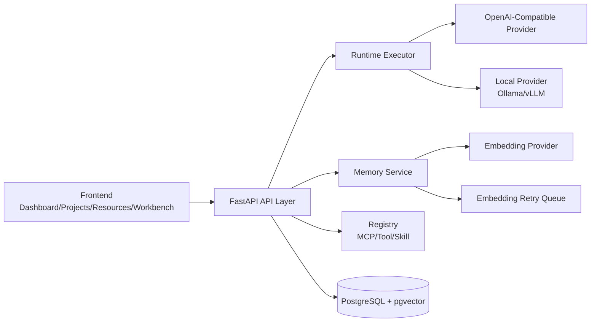
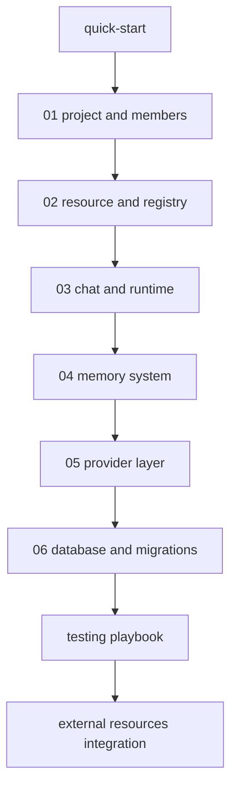

# HyperAgents Docs (中文 + English)

导航 / Navigation: [返回项目首页](../README.md) | [中文 README](../README.zh.md) | [English README](../README.en.md)

本目录是 HyperAgents 的文档门户，覆盖系统节点、测试手册与生产化接入建议。
This is the documentation hub for HyperAgents, covering architecture nodes, testing playbooks, and production integration guidance.

配置约定 / Configuration convention:
后端数据库、Provider、前端 API 地址统一从工作区根目录 `.env` 读取（模板：`.env.example`）。
Backend database/provider settings and frontend API endpoint are centrally managed in workspace-root `.env` (template: `.env.example`).

## 系统能力总览 / System Capability Overview

## 按目标阅读 / Read by Goal

1. 快速跑起来 / Get running quickly: [docs/quick-start.zh-en.md](quick-start.zh-en.md)
2. 端到端联调 / End-to-end API+UI validation: [docs/testing-playbook.zh-en.md](testing-playbook.zh-en.md)
3. 外部资源接入 / External integration and production setup: [docs/external-resources-integration.zh-en.md](external-resources-integration.zh-en.md)
4. 理解系统设计 / Understand architecture nodes: [docs/nodes](nodes)

## 节点文档 / Node Documents

1. [docs/nodes/01-project-and-members.zh-en.md](nodes/01-project-and-members.zh-en.md): Project 与成员权限 / Project and membership
2. [docs/nodes/02-resource-and-registry.zh-en.md](nodes/02-resource-and-registry.zh-en.md): Resource 与 Registry / Resource and registry
3. [docs/nodes/03-chat-and-runtime.zh-en.md](nodes/03-chat-and-runtime.zh-en.md): Chat 与 Runtime / Chat and runtime
4. [docs/nodes/04-memory-system.zh-en.md](nodes/04-memory-system.zh-en.md): Memory 分层、检索、重试 / Memory layers, retrieval, retry
5. [docs/nodes/05-provider-layer.zh-en.md](nodes/05-provider-layer.zh-en.md): LLM/Embedding Provider 适配 / Provider abstraction
6. [docs/nodes/06-database-and-migrations.zh-en.md](nodes/06-database-and-migrations.zh-en.md): PostgreSQL/pgvector + Alembic

## 推荐学习路径 / Suggested Learning Path

## 当前覆盖范围 / Current Coverage

- Project-first domain model and visibility rules
- Runtime provider routing for chat and embedding
- Memory write/search, semantic retrieval, retry queue
- Registry lifecycle for MCP/Tool/Skill
- Migration-based schema evolution with Alembic
- Multi-environment configuration and startup scripts
