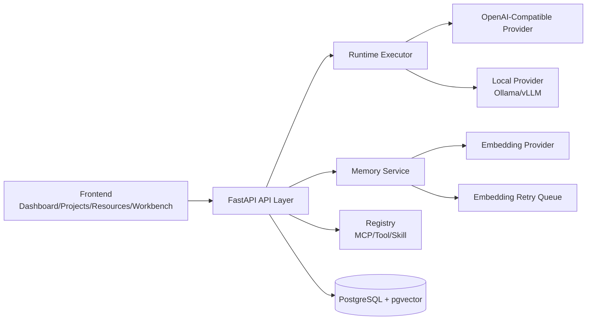

# HyperAgents Docs (中文 + English)

导航 / Navigation: [返回项目首页](../README.md) | [中文 README](../README.zh.md) | [English README](../README.en.md)

本目录是 HyperAgents 的文档门户，覆盖系统节点、模块指南、测试手册与生产化接入建议。
This is the documentation hub for HyperAgents, covering architecture nodes, module guides, testing playbooks, and production integration guidance.

配置约定 / Configuration convention:
后端数据库、Provider、前端 API 地址统一从工作区根目录 `.env` 读取（模板：`.env.example`）。
Backend database/provider settings and frontend API endpoint are centrally managed in workspace-root `.env` (template: `.env.example`).

## 系统能力总览 / System Capability Overview

```mermaid
flowchart LR
    UI[Frontend\nDashboard/Projects/Resources/Workbench] --> API[FastAPI API Layer]
    API --> Runtime[Runtime Executor]
    Runtime --> LLM1[OpenAI-Compatible Provider]
    Runtime --> LLM2[Local Provider\nOllama/vLLM]
    API --> Memory[Memory Service]
    Memory --> Embed[Embedding Provider]
    API --> Registry[Registry\nMCP/Tool/Skill]
    API --> DB[(PostgreSQL + pgvector)]
    Memory --> Retry[Embedding Retry Queue]
```

## 按目标阅读 / Read by Goal

1. 快速跑起来 / Get running quickly: [guides/quick-start.zh-en.md](guides/quick-start.zh-en.md)
2. 对齐当前代码和 API / Check current code and API surface: [reference/code-api-map.zh-en.md](reference/code-api-map.zh-en.md)
3. 端到端联调 / End-to-end API+UI validation: [guides/testing-playbook.zh-en.md](guides/testing-playbook.zh-en.md)
4. 前端使用说明 / Frontend workbench guide: [guides/frontend-guide.zh-en.md](guides/frontend-guide.zh-en.md)
5. Runtime 与 Worker 详细说明 / Runtime run and worker guide: [guides/runtime-run-worker.zh-en.md](guides/runtime-run-worker.zh-en.md)
6. API 变更日志 / API changelog: [reference/api-changelog.zh-en.md](reference/api-changelog.zh-en.md)
7. 部署与运维手册 / Deployment and operations guide: [operations/deployment-operations.zh-en.md](operations/deployment-operations.zh-en.md)
8. 按角色阅读 / Role-based reading guide: [roles/roles-overview.zh-en.md](roles/roles-overview.zh-en.md)
9. 外部资源接入 / External integration and production setup: [guides/external-resources-integration.zh-en.md](guides/external-resources-integration.zh-en.md)
10. 理解系统设计 / Understand architecture nodes: [nodes](nodes)

## 文档组织 / Documentation Organization

- `guides/`: 启动、测试、前端、runtime/worker、外部接入。
- `modules/`: 按功能模块整理的用户侧能力说明。
- `nodes/`: 按系统节点整理的架构与实现说明。
- `roles/`: Developer、QA、Ops、PM 的阅读路径和检查清单。
- `reference/`: 代码/API 对齐、变更日志、路线图。
- `operations/`: 部署、生产配置、故障处理。
- `design/`: 较大设计调整或重构记录。

## 默认资源模板规范 / Default Resource Template Convention

系统默认资源模板保存在 `backend/app/core/default_resources.json`。

- 这里只放模板信息，不放真实密钥。
- 当前默认模板用于提供可选的 Agent 模板，用户选择后再创建为项目资源。
- 模板中的 `provider_profile` 用于映射环境变量前缀，例如 `zhipu` -> `ZHIPU_API_KEY`、`ZHIPU_BASE_URL`、`ZHIPU_DEFAULT_MODEL`。
- 新增 provider 时，优先新增模板，再补对应前缀的 `.env` 变量。

相关说明：

- [快速开始 / Quick Start](guides/quick-start.zh-en.md)
- [外部资源接入 / External Resources Integration](guides/external-resources-integration.zh-en.md)

## 节点文档 / Node Documents

1. [nodes/01-project-and-members.zh-en.md](nodes/01-project-and-members.zh-en.md): Project 与成员权限 / Project and membership
2. [nodes/02-resource-and-registry.zh-en.md](nodes/02-resource-and-registry.zh-en.md): Resource 与 Registry / Resource and registry
3. [nodes/03-chat-and-runtime.zh-en.md](nodes/03-chat-and-runtime.zh-en.md): Chat 与 Runtime / Chat and runtime
4. [nodes/04-memory-system.zh-en.md](nodes/04-memory-system.zh-en.md): Memory 分层、检索、重试 / Memory layers, retrieval, retry
5. [nodes/05-provider-layer.zh-en.md](nodes/05-provider-layer.zh-en.md): LLM/Embedding Provider 适配 / Provider abstraction
6. [nodes/06-database-and-migrations.zh-en.md](nodes/06-database-and-migrations.zh-en.md): PostgreSQL/pgvector + Alembic

## 当前覆盖范围 / Current Coverage

- Project-first domain model and visibility rules
- Runtime provider routing for chat and embedding
- Project-level Provider Connection with encrypted API key storage
- Runtime run timeline (runs + events)
- Memory write/search, semantic retrieval, retry queue
- Worker-ready embedding retry dispatch (enqueue + fallback)
- Registry lifecycle for MCP/Tool/Skill
- Migration-based schema evolution with Alembic
- Multi-environment configuration and startup scripts
