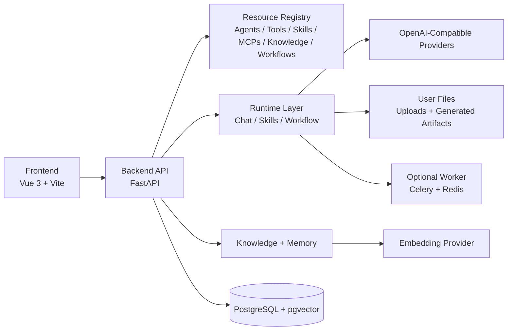

# HyperAgents：一个 Project-first 的 Agent Operating System，从资源管理到多 Agent Workflow 编排

> 本文是一篇项目介绍与架构说明，适合放在 CSDN、掘金、知乎、公众号或 GitHub Discussions。  
> 项目地址：`https://github.com/monkeyhlj/HyperAgents`  
> 在线文档：`https://monkeyhlj.github.io/HyperAgents/`

## 1. 为什么要做 HyperAgents

过去一段时间，Agent、MCP、RAG、Workflow、Skills 等概念发展得非常快。很多工具可以快速做一个聊天 Demo，或者把某个模型接入到前端页面里。但当我真正想把这些能力组织成一个可以长期迭代、可以多人协作、可以不断扩展的系统时，会发现单纯的“聊天窗口”远远不够。

一个真正可用的 Agent 系统，至少需要回答这些问题：

- Agent 属于哪个项目？谁可以访问？
- Agent 绑定了哪些 Tool、Skill、MCP、Knowledge Base？
- Skill 是如何上传、发现、激活和执行的？
- Knowledge Base 的文档、检索参数、绑定关系如何管理？
- Workflow 如何把多个 Agent 串起来，如何做分支和运行历史？
- Agent 生成的文件、用户上传的文件放在哪里？如何下载和清理？
- 每一次运行有没有日志、事件、状态和可追踪的 run history？

HyperAgents 就是围绕这些问题做的一个 **Project-first Agent Operating System 原型**。它不是一个单一的聊天 Demo，而是希望把 Agent 运行所需的核心对象统一组织起来，让 Agent、Tools、Skills、MCPs、Knowledge、Workflows、Files 都在一个项目空间里协作。

## 2. 项目定位

HyperAgents 的核心定位是：

> 以 Project 为边界，统一管理和运行 Agent 相关资源的全栈工作台。

目前它包含：

- FastAPI 后端
- Vue 3 + Vite 前端
- PostgreSQL + pgvector 数据库
- 项目与成员管理
- 统一 Resource Registry
- Agent Workbench
- Skill 上传与运行支持
- Knowledge Base 管理
- MCP / Tool 管理
- 可视化 Workflow Builder
- My Files 文件空间
- Runtime Run / Events / Run History
- Provider Profile / Provider Connection

截图占位：项目首页 / Dashboard


## 3. 核心设计理念：Project-first

很多 Agent 工具是以“某个 Agent”或“某个 Chat”为中心组织的。HyperAgents 选择了另一种方式：**Project-first**。

在 HyperAgents 中，所有资源都属于某个 Project：

- Agent
- Tool
- Skill
- MCP
- Knowledge Base
- Workflow
- Chat Session
- Runtime Run
- User Files

这样做的好处是：

1. 权限边界更清晰  
   每个资源都有 `private`、`project`、`public` 可见性。

2. 团队协作更自然  
   一个项目下可以有多个成员，项目资源可以被复用和组合。

3. 资源关系更容易管理  
   可以很清楚地看到某个 Agent 绑定了哪些 Skills、Knowledge Bases，以及被哪些 Workflows 使用。

4. 后续扩展更容易  
   无论是接入新的模型 Provider，还是增加新的 Workflow 节点类型，都可以围绕 Project 做扩展。

截图占位：Projects 页面


## 4. 系统整体架构

HyperAgents 是一个典型的前后端分离架构。



### 4.1 Frontend

前端使用 Vue 3 + Vite，目前主要页面包括：

- Dashboard
- Projects
- Resources
- Agents
- Tools
- Skills
- MCPs
- Knowledge Bases
- Workflows
- Workbench
- My Files

前端不是简单表单堆叠，而是围绕常见使用流程做了界面整理。例如：

- 左侧导航支持折叠和资源子菜单
- 顶部支持类似浏览器标签页的页面切换
- Workbench 提供类似现代 Chat 产品的对话体验
- Workflow 编辑页支持图形化画布和 JSON 同步
- Resource Detail 展示资源详情、绑定关系和关联资源

截图占位：Resources 页面


### 4.2 Backend

后端使用 FastAPI，主要负责：

- 用户认证
- Project 管理
- Resource CRUD
- Provider Connection 管理
- Agent Chat Runtime
- Skill Runtime
- Knowledge 文档与检索
- Workflow 定义与运行
- My Files 文件管理
- Runtime Run / Event 记录

### 4.3 Database

数据库使用 PostgreSQL，并通过 pgvector 支持向量检索。核心数据包括：

- users
- projects
- project_members
- resources
- skill_metadata
- agent_skill_bindings
- agent_knowledge_bindings
- knowledge_documents
- document_chunks
- chat_sessions
- chat_messages
- runtime_runs
- runtime_run_events
- workflow_runs
- workflow_step_executions

## 5. 统一 Resource 系统

HyperAgents 中最重要的抽象之一是 Resource。当前支持 6 类核心资源：

| 类型 | 说明 |
|---|---|
| Agent | 可以对话、执行任务、绑定能力的智能体 |
| Tool | 可调用的函数或代码工具 |
| Skill | 一份“怎么做”的能力说明书，可带脚本和模板 |
| MCP | Model Context Protocol Server 配置 |
| Knowledge Base | 文档知识库，可绑定到 Agent 做检索增强 |
| Workflow | 多 Agent / 多步骤编排定义 |

所有资源都具有统一字段：

- project_id
- owner_id
- kind
- name
- description
- visibility
- config
- created_at
- updated_at

这样可以让资源管理、权限判断、项目归属和前端展示变得统一。

截图占位：Resource Detail


## 6. Agents：项目中的核心执行单元

Agent 是 HyperAgents 里最核心的执行资源。每个 Agent 都属于某个 Project，并且可以配置模型、Provider Profile、系统提示词、运行模式和绑定能力。

当前 Agent 支持的核心信息包括：

- Agent 名称和描述
- 所属 Project
- 可见性：`private` / `project` / `public`
- Model Provider
- Model Name
- Provider Profile
- Provider Connection
- 运行配置 config
- 绑定的 Tools、Skills、MCPs、Knowledge Bases
- 被哪些 Workflows 引用

Agent Detail 页面会展示 Agent 的基础信息、模型设置、绑定能力和关联资源。这样在调试时可以很清楚地看到：这个 Agent 到底用了哪个模型，绑定了哪些 Skill，接入了哪些 Knowledge Base，以及是否参与了某个 Workflow。

截图占位：Agents 列表页面


截图占位：Agent Detail 页面


## 7. Tools：把可复用函数接入 Agent

Tool 用来封装可调用的函数、脚本或 API。相比直接把逻辑写进 Prompt，Tool 更适合承载确定性的操作，例如：

- 查询某个内部接口
- 执行一段 Python 逻辑
- 处理结构化输入输出
- 调用外部服务
- 给 code-mode Agent 提供函数能力

在 HyperAgents 中，Tool 也是一种 Resource，拥有统一的 Project 归属、可见性和配置字段。

Tool 当前常见配置包括：

- runtime
- entrypoint
- input_schema
- output_schema
- code
- timeout_seconds
- shared_in_project

这样 Agent 在运行时可以从项目中加载对应 Tool，而不是把所有逻辑写死在 Agent 代码里。

截图占位：Tools 列表页面


截图占位：Tool Detail / Edit 页面


## 8. MCPs：接入 Model Context Protocol 工具生态

MCP 是当前 Agent 工具生态里非常重要的一环。HyperAgents 把 MCP Server 配置也纳入统一 Resource 管理，让项目可以按需创建、测试和绑定 MCP。

MCP Resource 当前支持的核心配置包括：

- transport，例如 `streamable_http` 或 `stdio`
- endpoint_url
- command
- args
- headers
- env
- timeout_seconds

在 MCP 页面，可以测试 MCP 是否可用，并查看连接状态。Agent 运行时可以读取绑定的 MCP 配置，把 MCP 暴露的工具加入执行上下文。

这样做的好处是：

1. MCP 不再只是本地某个配置文件里的临时工具，而是项目资源。
2. 同一个 MCP 可以被项目中的多个 Agent 复用。
3. MCP 的连接配置、可见性和测试状态都可以在前端管理。
4. 后续可以进一步扩展 MCP 工具列表展示、工具调用日志和权限控制。

截图占位：MCPs 列表页面


截图占位：MCP Test 页面


## 9. Agent Workbench

Workbench 是测试 Agent 的主要入口。用户可以选择 Project，再选择某个 Agent 进行问答测试。

Workbench 当前支持：

- 持久化 Chat Session
- 选择 Agent 进行对话
- 展示当前对话 Agent 名称
- 显示运行中 loading 状态
- 显示使用到的 Skills / Knowledge Bases
- 关联 Runtime Run
- 生成文件后保存到 My Files
- 页面切换后尽量保持原有会话状态

截图占位：Workbench 对话页面


## 10. Skills：让 Agent 获得“怎么做”的能力

我对 Agent Skill 的理解是：

> Agent Skill 是一份“怎么做”的说明书。它通常是一个包含 `SKILL.md` 的文件夹，也可以附带脚本、模板和参考文件。

Skill 的设计哲学是渐进式披露：

1. Discovery  
   Agent 先只看到 Skill 的名称和简短描述。

2. Activation  
   当用户任务匹配某个 Skill 时，再加载完整 `SKILL.md`。

3. Execution  
   Agent 按照 Skill 指令执行任务，必要时读取附带文件或运行脚本。

HyperAgents 当前已经支持 Skill 上传、Agent 绑定、运行时发现和部分脚本执行路径。比如测试中上传过：

- `front-design`
- `xlsx`

不过这里也必须坦诚说明：

> Skills 功能目前还没有完全打磨到理想状态。尤其是复杂 Skill 的执行质量、脚本泛化调用、模型对 Skill 指令的遵循程度、前端生成物体验等，还需要继续调试和优化。

目前方向是让 Skill Runtime 更接近通用 Agent Skills 模式，而不是针对某个固定提示词做硬编码。也就是说，未来新增其他 Skill 时，不应该每次都专门改代码，而是通过通用的 Skill Loader、Skill Runtime、Skill Code Runner 和文件输出机制来支持。

截图占位：Skills 页面


## 11. Knowledge Base：让 Agent 带上项目知识

Knowledge Base 用来管理文档、切分、向量检索和 Agent 绑定。

当前能力包括：

- 创建 Knowledge Base
- 上传文档
- 管理文档列表
- 配置 chunk size、top_k、similarity threshold 等检索参数
- 绑定到 Agent
- Workbench 问答时作为上下文增强

在 Agent Detail 中，也可以看到当前 Agent 绑定了哪些 Knowledge Bases。

截图占位：Knowledge 页面


## 12. Workflow：图形化多 Agent 编排

Workflow 是 HyperAgents 后续非常重要的一部分。当前已经实现了基础 Workflow 能力：

- 创建 Workflow Resource
- 图形化 Canvas 编辑
- 添加 Agent 节点
- 节点之间连线
- 分支 routing 配置
- JSON 定义同步
- Test 运行
- Run History
- Step Execution 记录

一个典型 Workflow 可以是：

```text
用户输入：做一个关于“如何养成阅读习惯”的 1 分钟短视频

1. 策划 Agent：拆解选题，输出内容大纲和分镜框架
2. 文案 Agent：写逐字稿
3. 视觉 Agent：生成分镜描述和画面构图建议
4. 审核 Agent：合并输出、检查一致性、最终润色

最终输出：完整脚本 + 分镜 + 配乐推荐
```

截图占位：Workflow Canvas


截图占位：Workflow Run History


这里也需要说明：

> Workflow 当前也还在持续完善中。基础图形化编排、运行和历史记录已经具备，但更复杂的节点类型、分支条件、失败恢复、并行策略、变量映射和可视化调试体验，还需要继续迭代。

## 13. My Files：统一管理输入与生成物

Agent 和 Skill 经常会生成文件，例如：

- HTML 页面
- Excel 文件
- 文档
- 脚本输出
- 分析结果

HyperAgents 提供了 My Files 页面，用来统一管理：

- 用户上传文件
- Agent / Skill 生成文件
- 文件搜索
- 分页
- 下载
- 删除和清理

这让 Skill 的输出不必全部塞进聊天文本里，而是可以保存成实际文件，让用户直接下载和继续处理。

截图占位：My Files 页面


## 14. Provider 与模型接入

HyperAgents 采用 OpenAI-compatible Provider 思路。也就是说，只要某个模型服务兼容 OpenAI Chat Completions API，就可以通过类似下面的环境变量接入：

```bash
NVIDIA_API_KEY=xxx
NVIDIA_BASE_URL=xxx
NVIDIA_DEFAULT_MODEL=xxx
```

Agent 可以使用 `provider_profile` 来选择对应的环境变量前缀。例如：

```text
provider_profile = nvidia
```

系统就会读取：

```text
NVIDIA_API_KEY
NVIDIA_BASE_URL
NVIDIA_DEFAULT_MODEL
```

同时，项目级 Provider Connection 也支持把连接信息保存到数据库中，方便按项目管理不同模型配置。

## 15. 当前项目状态

HyperAgents 目前还在快速迭代中。已经完成并能测试的核心模块包括：

- Projects
- Agents
- Tools
- MCPs
- Knowledge
- Skills 基础上传与绑定
- Workbench
- My Files
- Workflow 基础图形化创建与测试
- Dashboard 优化
- Resource Detail 优化
- 文档站初步整理

但还需要继续打磨的重点包括：

- Skill Runtime 的泛化能力
- Skill 脚本执行的稳定性与安全边界
- front-design / xlsx 等复杂 Skill 的真实输出质量
- Workflow 的复杂分支、并行和变量映射
- Workflow 调试体验
- 更完整的端到端测试
- 更漂亮和更系统化的前端交互体验

## 16. 后续计划

接下来计划重点优化：

1. 通用 Skill Code Runner  
   不针对具体 Skill 写死逻辑，而是尽量遵循 Agent Skills 的通用执行模式。

2. Skill 输出文件体验  
   让 HTML、XLSX、文档等文件生成后直接进入 My Files，而不是把长代码塞进聊天窗口。

3. Workflow 节点体系  
   增加更多节点类型，例如 Agent Node、Tool Node、Condition Node、Merge Node、Human Review Node。

4. Workflow 可观测性  
   更清晰地展示每个 step 的输入、输出、耗时、错误和重试信息。

5. 文档和示例  
   增加更多真实使用案例，例如：数据分析工作流、内容生产工作流、知识库问答 Agent、Excel 自动化 Skill。

6. 前端体验  
   继续优化 Dashboard、Workbench、Resource Detail、Workflow Canvas 和 My Files。

## 17. 适合哪些人关注

如果你正在关注下面这些方向，可能会对 HyperAgents 感兴趣：

- Agent 平台设计
- 多 Agent Workflow
- MCP 工具生态
- Agent Skill 机制
- RAG / Knowledge Base
- OpenAI-compatible 模型接入
- 企业内部 AI 工作台
- 文件型 Agent 输出
- 从 Demo 到系统化 Agent 平台的工程实践

## 18. 一些个人建议和思考

做这个项目的过程中，我越来越觉得 Agent 平台的难点不只是“调模型”。更复杂的问题往往在工程层：

- 资源如何组织？
- 权限如何划分？
- Prompt、Skill、Tool、Knowledge 如何解耦？
- 用户生成的文件如何管理？
- 每次运行如何追踪？
- Workflow 如何从简单串行走向复杂编排？

所以 HyperAgents 的价值不在于又做了一个聊天框，而是在尝试把 Agent 系统需要的基础设施逐步搭起来。

当然，项目现在还不完美。尤其 Skills 和 Workflow 都还需要继续调试和迭代。但我希望把这个过程公开出来，也欢迎大家一起讨论：什么样的 Agent 平台设计才更合理？Skills 应该如何执行？Workflow 应该如何建模？前端交互应该如何设计？

## 19. 欢迎 Star 和建议

如果你觉得这个项目方向有价值，欢迎给 GitHub 项目点一个 Star：

```text
https://github.com/monkeyhlj/HyperAgents
```

也欢迎提出 Issue、建议或改进方向。尤其欢迎关于下面这些方面的反馈：

- Skill Runtime 如何设计得更通用？
- Workflow 节点和分支应该如何抽象？
- Agent 绑定 Tool / Skill / MCP / Knowledge 的交互是否清晰？
- Workbench 的测试体验还缺什么？
- 文档对第一次接触项目的人是否足够清楚？
- 你希望看到哪些真实案例？

如果这个项目能帮到你，或者你也在研究 Agent 平台工程化，欢迎一起交流。