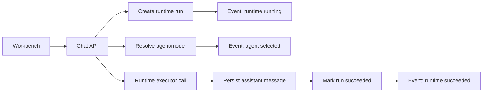

# Runtime Run & Worker Guide (中文 + English)

导航 / Navigation: [返回项目首页](../../README.md) | [文档首页](../README.md) | [测试手册](testing-playbook.zh-en.md)

## 1) 目标 / Goal

中文：
本文说明 HyperAgents 新增的 Runtime Run 执行轨迹模型和 Worker 排队重试机制，帮助你完成执行可观测化和异步化演进。

English:
This guide explains the Runtime Run timeline model and Worker queue-based retry mechanism added to HyperAgents for better observability and async execution.

## 2) Runtime Run 模型 / Runtime Run Model

### 2.1 核心对象 / Core Objects

1. runtime_runs
- 一次运行记录（run）
- 包含 session_id、project_id、agent_id、status、input/output、started_at/finished_at

2. runtime_run_events
- 运行阶段事件（timeline events）
- 包含 stage、status、message、payload、created_at

### 2.2 状态建议 / Suggested Statuses

- running
- succeeded
- failed

### 2.3 阶段建议 / Suggested Stages

- runtime
- agent
- tool
- mcp
- memory

当前版本已实现 runtime 与 agent 两个阶段事件。

## 3) Chat 执行链 / Execution Chain

当前请求链路：



若执行失败：
- run.status 置为 failed
- 记录 failed 事件与错误信息

## 4) API 说明 / API Reference

### 4.1 会话与消息 / Sessions and Messages

1. POST /api/v1/chat/projects/{project_id}/sessions
- 创建会话

2. GET /api/v1/chat/projects/{project_id}/sessions
- 查询项目会话列表

3. POST /api/v1/chat/sessions/{session_id}/messages
- 发送消息并触发 runtime run
- 响应中返回 run_id

4. GET /api/v1/chat/sessions/{session_id}/messages
- 查询消息历史

### 4.2 Run Timeline

1. GET /api/v1/chat/sessions/{session_id}/runs
- 查询该 session 下运行记录列表

2. GET /api/v1/chat/runs/{run_id}/events
- 查询指定 run 的时间线事件

## 5) Workbench 行为 / Workbench Behavior

当前 Workbench 增强行为：

1. 按项目筛选并选择当前项目
2. 加载该项目 Agent 列表并下拉选择
3. 创建/加载会话
4. 发送消息后自动刷新 run 列表
5. 点击 run 查看事件 timeline

## 6) Worker 机制 / Worker Mode

### 6.1 目标

将长任务、重试任务从 API 进程中解耦。

### 6.2 当前实现

1. Memory 重试接口支持两种模式：
- 直接执行（默认）
- enqueue=true 排队执行（启用 worker 时）

2. 任务名称：
- hyperagents.tasks.process_embedding_retry

3. 回退策略：
- 若 worker 未开启或队列不可用，自动回退到 API 进程执行

### 6.3 环境变量

在 workspace 根目录 .env：

- WORKER_ENABLED=false
- WORKER_BROKER_URL=redis://localhost:6379/0
- WORKER_BACKEND_URL=redis://localhost:6379/1

### 6.4 启动示例

先安装 backend 依赖，再启动 worker：

```powershell
cd backend
.venv\Scripts\activate
pip install -r requirements.txt
celery -A app.workers.celery_app.celery_app worker -l info
```

### 6.5 排队触发示例

```powershell
curl -X POST "http://localhost:8000/api/v1/memory/retry-embeddings?limit=20&enqueue=true" -H "Authorization: Bearer <access_token>"
```

若排队成功，返回字段：
- queued=true
- task_id=<celery task id>

## 7) 数据迁移 / Migration

本功能需要执行最新 Alembic 迁移：

```powershell
cd backend
.venv\Scripts\activate
alembic upgrade head
```

新增迁移：
- 0004_runtime_runs_and_events

## 8) 常见问题 / FAQ

1. 为什么 run 列表为空？
- 确认消息是通过 POST /chat/sessions/{session_id}/messages 发送。

2. 为什么 events 很少？
- 当前仅实现 runtime/agent 关键事件，后续可扩展 tool/mcp/memory 级事件。

3. enqueue=true 还是本地执行？
- 检查 WORKER_ENABLED 是否为 true，Redis 是否可达，Celery worker 是否启动。

4. 是否必须先上 Celery？
- 不是。当前设计支持“先本地执行，后无缝切队列”。

## 9) 下一步建议 / Next Steps

1. 增加 run token usage、latency 分段字段
2. 增加 tool/mcp/memory 事件埋点
3. 增加任务中心页面（task queue + retry + logs）
