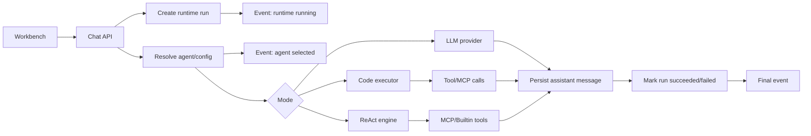

# Runtime Run & Worker Guide (中文 + English)

导航 / Navigation: [返回项目首页](../../README.md) | [文档首页](../README.md) | [测试手册](testing-playbook.zh-en.md)

## 1) 目标 / Goal

本文说明 HyperAgents 的 Runtime Run 执行轨迹模型和 Worker 排队重试机制，用于执行可观测化和异步任务演进。

This guide explains the Runtime Run timeline model and Worker queue-based retry mechanism for observability and async execution.

## 2) Runtime Run 模型 / Runtime Run Model

### 2.1 核心对象 / Core Objects

1. `runtime_runs`
- 一次运行记录。
- 包含 `session_id`、`project_id`、`agent_id`、`status`、`input_text`、`output_text`、`started_at`、`finished_at`。

2. `runtime_run_events`
- 运行阶段事件。
- 包含 `stage`、`status`、`message`、`payload`、`created_at`。

### 2.2 当前状态 / Current Statuses

- `running`
- `succeeded`
- `failed`

### 2.3 当前阶段 / Current Stages

当前代码已覆盖这些事件来源：

- `runtime`: run 开始、完成、失败。
- `agent`: Agent、provider、model、engine 信息。
- `code_execution`: code-mode Agent 执行开始、结果、错误。
- `tool` / `mcp`: Tool/MCP 调用摘要与标签。
- ReAct event payload: thought/action/observation/final_answer。

Memory/provider/token-level 细粒度指标仍是后续增强方向。

## 3) Chat 执行链 / Execution Chain


```mermaid
flowchart LR
    UI[Workbench] --> API[Chat API]
    API --> RUN[Create runtime run]
    RUN --> EVT1[Event: runtime running]
    API --> AGT[Resolve agent/config]
    AGT --> EVT2[Event: agent selected]
    AGT --> MODE{Mode}
    MODE --> LLM[LLM provider]
    MODE --> CODE[Code executor]
    MODE --> REACT[ReAct engine]
    CODE --> TOOL[Tool/MCP calls]
    REACT --> MCP[MCP/Builtin tools]
    LLM --> MSG[Persist assistant message]
    TOOL --> MSG
    MCP --> MSG
    MSG --> DONE[Mark run succeeded/failed]
    DONE --> EVT3[Final event]
```

若执行失败：

- `run.status=failed`
- 记录 failed event 与错误信息
- code-mode 错误可通过 `code-execution-audits` 查询

## 4) API 说明 / API Reference

### 4.1 会话与消息 / Sessions and Messages

- `POST /api/v1/chat/projects/{project_id}/sessions`
- `GET /api/v1/chat/projects/{project_id}/sessions`
- `POST /api/v1/chat/sessions/{session_id}/messages`
- `GET /api/v1/chat/sessions/{session_id}/messages`

发送消息响应返回：

- `run_id`
- `used_tools`
- `used_mcps`

### 4.2 Run Timeline

- `GET /api/v1/chat/sessions/{session_id}/runs`
- `GET /api/v1/chat/runs/{run_id}/events`
- `GET /api/v1/chat/code-execution-audits`

## 5) Workbench 行为 / Workbench Behavior

1. 按项目筛选并选择当前项目。
2. 加载该项目 Agent 列表并下拉选择。
3. 创建/加载会话。
4. 发送消息后自动刷新 run 列表。
5. 点击 run 查看事件 timeline。
6. Assistant 消息展示 Tool/MCP 调用标签。

## 6) Worker 机制 / Worker Mode

### 6.1 目标

将长任务、重试任务从 API 进程中解耦。

### 6.2 当前实现

1. Memory 重试接口支持两种模式：
- 直接执行（默认）。
- `enqueue=true` 排队执行（启用 worker 时）。

2. 任务名称：
- `hyperagents.tasks.process_embedding_retry`

3. 回退策略：
- 若 worker 未开启或队列不可用，自动回退到 API 进程执行。

### 6.3 环境变量

```dotenv
WORKER_ENABLED=false
WORKER_BROKER_URL=redis://localhost:6379/0
WORKER_BACKEND_URL=redis://localhost:6379/1
```

### 6.4 启动示例

```powershell
cd backend
.venv\Scripts\activate
pip install -r requirements.txt
celery -A app.workers.celery_app.celery_app worker -l info
```

### 6.5 排队触发示例

```powershell
curl -X POST "http://localhost:8000/api/v1/memory/retry-embeddings?limit=20&enqueue=true" -H "Authorization: Bearer <access_token>"
```

若排队成功，返回：

- `queued=true`
- `task_id=<celery task id>`

## 7) 数据迁移 / Migration

```powershell
cd backend
.venv\Scripts\activate
alembic upgrade head
```

相关迁移：

- `0004_runtime_runs_and_events`
- `0006_provider_connections`

## 8) 常见问题 / FAQ

1. 为什么 run 列表为空？
- 确认消息是通过 `POST /api/v1/chat/sessions/{session_id}/messages` 发送。

2. 为什么 events 里没有 token usage？
- 当前尚未将 token usage/latency breakdown 作为一等指标持久化。

3. enqueue=true 还是本地执行？
- 检查 `WORKER_ENABLED` 是否为 true，Redis 是否可达，Celery worker 是否启动。

4. 是否必须先上 Celery？
- 不是。当前设计支持先本地执行，后无缝切队列。

## 9) 下一步建议 / Next Steps

1. 增加 run token usage、latency 分段字段。
2. 增加任务状态 API 与任务中心 UI。
3. 扩展 provider/memory 细粒度事件。
4. 将 workflow runtime 复用 Runtime Run/Event 模型。
