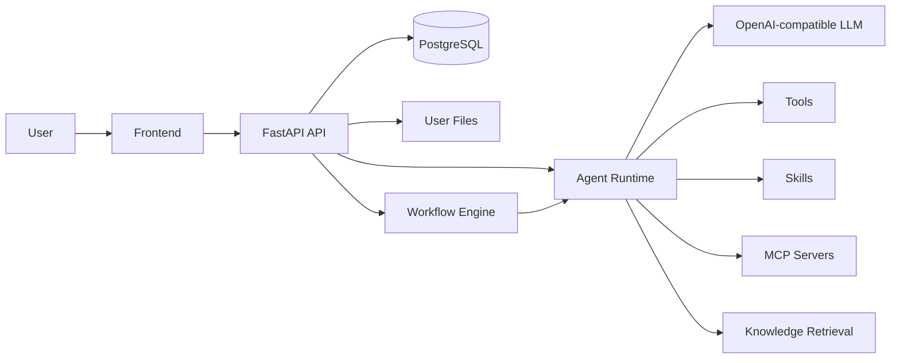

# HyperAgents Documentation

HyperAgents 是一个 Project-first 的 Agent 平台骨架：先创建 Project，再在项目内管理 Agents、Tools、Skills、MCPs、Knowledge 和 Workflows，最后通过 Workbench 或 Workflow Run 进行测试和执行。

HyperAgents is a project-first agent platform skeleton. You create a Project first, add reusable resources inside it, then test agents in Workbench or orchestrate them through Workflows.

## 第一次应该怎么看 / First Reading Path

1. [Quick Start](guides/quick-start.zh-en.md): 把后端、前端、数据库先跑起来。 / Start the backend, frontend, and database first.
2. [Frontend Guide](guides/frontend-guide.zh-en.md): 了解页面入口和日常操作路径。 / Learn the page entry points and daily operating flow.
3. [Resources](modules/resources.zh-en.md): 理解所有能力都以 Resource 形式管理。 / Understand that every reusable capability is managed as a Resource.
4. [Agents](modules/agents.zh-en.md): 创建可对话、可绑定能力的 Agent。 / Create Agents that can chat and bind reusable capabilities.
5. [Tools](modules/tools.zh-en.md), [Skills](modules/skills.zh-en.md), [MCPs](modules/mcps.zh-en.md), [Knowledge](modules/knowledge.zh-en.md): 分别理解四类可复用能力。 / Learn the main reusable capability types separately.
6. [Workbench](modules/workbench.zh-en.md): 测试单个 Agent 的对话、工具、知识库和 Skill 行为。 / Test one Agent with chat, tools, knowledge, and Skills.
7. [Workflows](modules/workflows.zh-en.md): 测试多 Agent 流程编排和运行历史。 / Test multi-Agent orchestration and run history.
8. [Code and API Map](reference/code-api-map.zh-en.md): 当你要改代码或对接口时，从这里确认当前事实。 / Use this as the source of truth before changing code or APIs.

## 核心概念 / Core Concepts

| Concept | 中文说明 | English |
| --- | --- | --- |
| Project | 权限、资源和会话的归属边界。 | Ownership boundary for permissions, resources, and chat sessions. |
| Resource | Agent、Tool、Skill、MCP、Knowledge、Workflow 的统一存储模型。 | Unified model for Agents, Tools, Skills, MCPs, Knowledge, and Workflows. |
| Agent | 执行问答、调用工具、读取知识、激活 Skill 的主体。 | The runnable actor for chat, tools, knowledge, and skills. |
| Tool | 后端可执行的函数能力，适合确定性操作。 | Executable function capability for deterministic operations. |
| Skill | 一份“怎么做”的说明书，可附带脚本，按需加载。 | A reusable how-to package, optionally with scripts, loaded on demand. |
| MCP | 外部工具服务描述与调用入口。 | Integration descriptor for external MCP tool servers. |
| Knowledge | 文档上传、切分、向量化和检索。 | Document upload, chunking, embedding, and retrieval. |
| Workflow | 多 Agent DAG 编排、运行记录和步骤追踪。 | Multi-agent DAG orchestration with run history and step trace. |
| My Files | 用户上传和运行生成文件的统一下载/清理入口。 | Unified file area for uploads and generated artifacts. |

## 常见任务 / Common Tasks

| 我要做什么 / Goal | 推荐文档 / Recommended docs |
| --- | --- |
| 本地启动项目 / Run locally | [Quick Start](guides/quick-start.zh-en.md) |
| 增加或测试模型连接 / Add or test model connection | [Agents](modules/agents.zh-en.md), [Provider Layer](nodes/05-provider-layer.zh-en.md) |
| 创建一个可调用函数 / Create a callable function | [Tools](modules/tools.zh-en.md) |
| 上传并绑定 Skill / Upload and bind a Skill | [Skills](modules/skills.zh-en.md) |
| 接入外部 MCP 服务 / Connect an external MCP service | [MCPs](modules/mcps.zh-en.md), [External Integration](guides/external-resources-integration.zh-en.md) |
| 上传知识库文档 / Upload knowledge documents | [Knowledge](modules/knowledge.zh-en.md) |
| 测试单个 Agent / Test one Agent | [Workbench](modules/workbench.zh-en.md) |
| 编排多个 Agent / Orchestrate multiple Agents | [Workflows](modules/workflows.zh-en.md) |
| 查 API 和表结构 / Check APIs and tables | [Code and API Map](reference/code-api-map.zh-en.md) |
| 做回归测试 / Run regression tests | [Testing Playbook](guides/testing-playbook.zh-en.md) |
| 清理代码和维护文档 / Clean code and maintain docs | [Maintenance Audit](reference/maintenance-audit.zh-en.md) |

## 系统关系 / System Shape

## 文档维护原则 / Documentation Rules

- `mkdocs.yml` 是 GitHub Pages 导航的事实来源。 / `mkdocs.yml` is the source of truth for GitHub Pages navigation.
- `reference/code-api-map.zh-en.md` 记录当前代码事实；接口、表、路由变化时优先更新它。 / `reference/code-api-map.zh-en.md` records current code facts; update it first when APIs, tables, or routes change.
- `modules/` 面向使用者，说明页面怎么用、能力是什么、怎么测试。 / `modules/` is user-facing and explains how pages work, what capabilities do, and how to test them.
- `nodes/` 面向开发者，说明架构节点、数据模型和运行路径。 / `nodes/` is developer-facing and explains architecture nodes, data models, and runtime paths.
- `design/` 记录设计方案和历史决策，不替代当前使用文档。 / `design/` records proposals and historical decisions; it does not replace current user documentation.