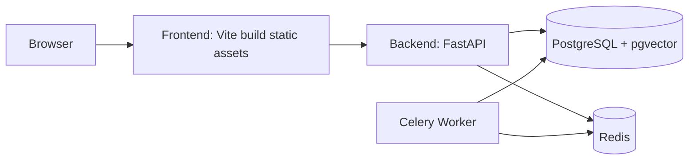

# Deployment & Operations Guide (中文 + English)

导航 / Navigation: [返回项目首页](../../README.md) | [文档首页](../README.md) | [架构路线](../reference/architecture-roadmap.zh-en.md)

## 1) Deployment Topology

推荐部署拓扑：



中文：
- 小规模可先不启 Worker，内置回退模式可工作。
- 生产建议启用 Redis + Celery 以承载异步任务。

English:
- Small setups can run without worker using fallback mode.
- Production should enable Redis + Celery for async workloads.

## 2) Environment Variables

核心变量建议：

```dotenv
DATABASE_URL=postgresql+psycopg://<user>:<pass>@<host>:5432/hyperagents
VITE_API_BASE_URL=http://<api-host>:8000
OPENAI_API_KEY=<your_key>
OPENAI_BASE_URL=<provider_url>
OPENAI_DEFAULT_MODEL=<model>
OPENAI_EMBEDDING_MODEL=<embedding_model>
RUNTIME_DEFAULT_PROVIDER=openai
EMBEDDING_PROVIDER=openai
WORKER_ENABLED=true
WORKER_BROKER_URL=redis://<redis-host>:6379/0
WORKER_BACKEND_URL=redis://<redis-host>:6379/1
```

安全建议：
- 不要将真实密钥提交到仓库。
- 定期轮换 API keys。
- 生产环境应使用 Secret Manager 或 CI/CD Secret。

## 3) Backend Deployment Steps

```powershell
cd backend
python -m venv .venv
.venv\Scripts\activate
pip install -r requirements.txt
alembic upgrade head
uvicorn app.main:app --host 0.0.0.0 --port 8000
```

生产建议：
- 使用 gunicorn/uvicorn workers 或容器编排。
- 将 `AUTO_CREATE_TABLES` 保持关闭，统一通过 Alembic 迁移。

## 4) Frontend Deployment Steps

```powershell
cd frontend
npm install
npm run build
```

输出目录：
- `frontend/dist`

可部署到：
- Nginx
- Apache
- CDN + Object Storage

## 5) Worker Deployment Steps (Optional but Recommended)

```powershell
cd backend
.venv\Scripts\activate
celery -A app.workers.celery_app.celery_app worker -l info
```

验收方式：
1. 调用 `POST /api/v1/memory/retry-embeddings?enqueue=true`
2. 返回 `queued=true` 且 `task_id` 非空
3. Worker 日志可见任务执行

## 6) Health and Runtime Checks

1. API health:

```powershell
curl http://localhost:8000/health
```

2. Runtime run pipeline:
- 发送 chat message
- 查询 runs
- 查询 run events

3. Memory retry queue:
- 触发 enqueue=true
- 检查 worker log 和数据库状态

## 7) Ops Checklist

发布前：
1. 备份数据库。
2. 执行 `alembic upgrade head`。
3. 验证 auth 登录流程。
4. 验证 project/resource/chat/run APIs。
5. 验证 Workbench 时间线显示。

发布后：
1. 观察 API 5xx 和响应耗时。
2. 观察 Worker 失败重试率。
3. 抽检 memory embedding 成功率。

## 8) Troubleshooting

1. `relation ... does not exist`
- 原因：迁移未执行到最新
- 处理：`alembic upgrade head`

2. `queued=false` when enqueue=true
- 原因：Worker disabled / Redis unreachable / Celery not running
- 处理：检查 `WORKER_ENABLED`、Redis、worker 进程

3. API can call but timeline empty
- 原因：前端未调用 runs/events 或消息未通过 chat endpoint
- 处理：先检查 `/api/v1/chat/sessions/{session_id}/runs`

4. OpenAI compatible provider errors
- 原因：base_url/model/api_key 配置不一致
- 处理：先用最小 curl 调通 provider，再接入平台

## 9) Suggested Production Hardening

1. 增加 API 限流和鉴权策略（IP/用户级）。
2. 增加请求追踪 ID（trace_id）贯穿 run/event。
3. 增加结构化日志（JSON）并接入日志平台。
4. 增加 metrics（Prometheus）与告警（运行失败率、队列堆积）。
5. 使用容器编排（Docker Compose/Kubernetes）标准化部署。
