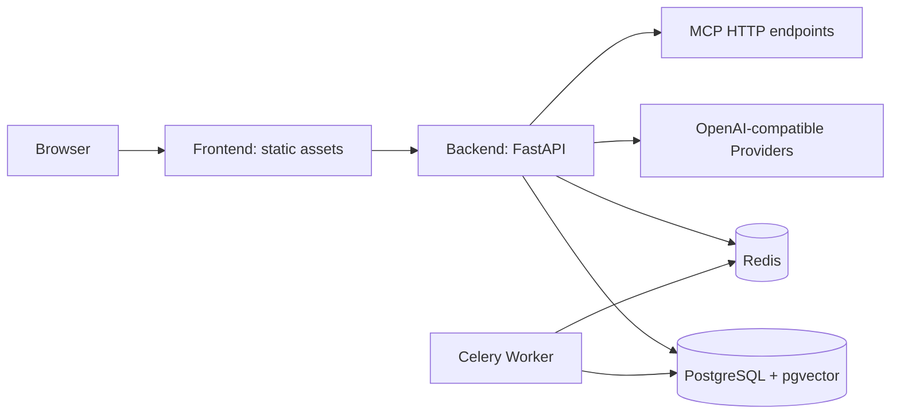

# Deployment & Operations Guide (中文 + English)

导航 / Navigation: [返回项目首页](../../README.md) | [文档首页](../README.md) | [架构路线](../reference/architecture-roadmap.zh-en.md)

## 1) Deployment Topology

推荐部署拓扑：


```mermaid
flowchart LR
    User[Browser] --> FE[Frontend: static assets]
    FE --> API[Backend: FastAPI]
    API --> DB[(PostgreSQL + pgvector)]
    API --> REDIS[(Redis)]
    WORKER[Celery Worker] --> REDIS
    WORKER --> DB
    API --> LLM[OpenAI-compatible Providers]
    API --> MCP[MCP HTTP endpoints]
```

- 小规模可先不启 Worker，内置 fallback 可工作。
- 生产建议启用 Redis + Celery 承载异步任务。
- Provider/MCP 外部 endpoint 建议配置健康检查、超时和告警。

## 2) Environment Variables

核心变量建议：

```dotenv
DATABASE_URL=postgresql+psycopg://<user>:<pass>@<host>:5432/hyperagents
AUTO_CREATE_TABLES=false
CORS_ALLOW_ORIGINS=https://<frontend-host>
VITE_API_BASE_URL=https://<api-host>
AUTH_SECRET_KEY=<stable-secret>
PROVIDER_CONNECTION_SECRET_KEY=<stable-secret>
OPENAI_API_KEY=<your_key>
OPENAI_BASE_URL=<provider_url>
OPENAI_DEFAULT_MODEL=<model>
OPENAI_EMBEDDING_MODEL=<embedding_model>
RUNTIME_DEFAULT_PROVIDER=openai
EMBEDDING_PROVIDER=openai
MEMORY_EMBEDDING_DIMENSIONS=1536
MODEL_REQUEST_TIMEOUT_SECONDS=60
CODE_EXECUTION_TIMEOUT_SECONDS=5
CODE_EXECUTION_MAX_OUTPUT_CHARS=8000
WORKER_ENABLED=true
WORKER_BROKER_URL=redis://<redis-host>:6379/0
WORKER_BACKEND_URL=redis://<redis-host>:6379/1
```

安全建议：

- 不要将真实密钥提交到仓库。
- 生产环境必须稳定保存 `AUTH_SECRET_KEY` 和 `PROVIDER_CONNECTION_SECRET_KEY`。
- `PROVIDER_CONNECTION_SECRET_KEY` 变更会影响已加密 API Key 的解密，变更前需要重加密策略。
- 定期轮换 Provider/MCP API keys。
- 生产环境使用 Secret Manager 或 CI/CD Secret。

## 3) Backend Deployment Steps

```powershell
cd backend
python -m venv .venv
.venv\Scripts\activate
pip install -r requirements.txt
alembic upgrade head
uvicorn app.main:app --host 0.0.0.0 --port 8000
```

生产建议：

- 使用 gunicorn/uvicorn workers 或容器编排。
- 将 `AUTO_CREATE_TABLES` 保持关闭，统一通过 Alembic 迁移。
- 发布前确认 pgvector extension 可用。

## 4) Frontend Deployment Steps

```powershell
cd frontend
npm install
npm run build
```

输出目录：`frontend/dist`

可部署到 Nginx、Apache、CDN + Object Storage。

## 5) Worker Deployment Steps (Optional but Recommended)

```powershell
cd backend
.venv\Scripts\activate
celery -A app.workers.celery_app.celery_app worker -l info
```

验收方式：

1. 调用 `POST /api/v1/memory/retry-embeddings?enqueue=true`。
2. 返回 `queued=true` 且 `task_id` 非空。
3. Worker 日志可见任务执行。

## 6) Health and Runtime Checks

1. API health:

```powershell
curl http://localhost:8000/health
```

2. Auth:
- register/login。
- `GET /api/v1/auth/me`。

3. Runtime run pipeline:
- 创建 project/agent/session。
- 发送 chat message。
- 查询 runs。
- 查询 run events。

4. Provider Connection:
- probe models。
- test connection。
- 创建/更新连接后确认 masked key 返回。

5. MCP:
- probe `streamable_http` endpoint。
- 验证 tools 非空。

6. Memory retry queue:
- 触发 `enqueue=true`。
- 检查 worker log 和数据库状态。

## 7) Ops Checklist

发布前：

1. 备份数据库。
2. 执行 `alembic upgrade head`。
3. 验证 auth 登录流程。
4. 验证 project/resource/provider/chat/run APIs。
5. 验证 Workbench 时间线显示。
6. 验证 Provider Connection 加密密钥配置。
7. 验证 Worker queue/fallback。

发布后：

1. 观察 API 5xx 和响应耗时。
2. 观察 run failed 比率。
3. 观察 Worker 失败重试率。
4. 抽检 memory embedding 成功率。
5. 抽检 Provider/MCP 连接失败率。

## 8) Troubleshooting

1. `relation ... does not exist`
- 原因：迁移未执行到最新。
- 处理：`alembic upgrade head`。

2. `queued=false` when enqueue=true
- 原因：Worker disabled / Redis unreachable / Celery not running。
- 处理：检查 `WORKER_ENABLED`、Redis、worker 进程。

3. API can call but timeline empty
- 原因：前端未调用 runs/events 或消息未通过 chat endpoint。
- 处理：先检查 `/api/v1/chat/sessions/{session_id}/runs`。

4. OpenAI-compatible provider errors
- 原因：base_url/model/api_key 配置不一致。
- 处理：先用 Provider Connection test 或最小 curl 调通 provider。

5. Provider Connection cannot decrypt key
- 原因：`PROVIDER_CONNECTION_SECRET_KEY` 与写入时不一致。
- 处理：恢复原 secret，或执行密钥重加密迁移。

6. MCP probe timeout
- 原因：endpoint 不可达、headers 错误或 timeout 太短。
- 处理：检查 MCP `/health`、`/tools` 和网络策略。

## 9) Suggested Production Hardening

1. 增加 API 限流和鉴权策略（IP/用户级）。
2. 增加请求追踪 ID（trace_id）贯穿 run/event。
3. 增加结构化日志（JSON）并接入日志平台。
4. 增加 metrics（Prometheus）与告警（运行失败率、队列堆积、Provider/MCP 失败率）。
5. 使用容器编排（Docker Compose/Kubernetes）标准化部署。
6. 为 public registry 增加审核、版本和发布状态。
